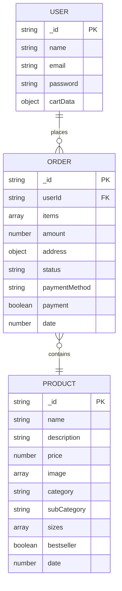
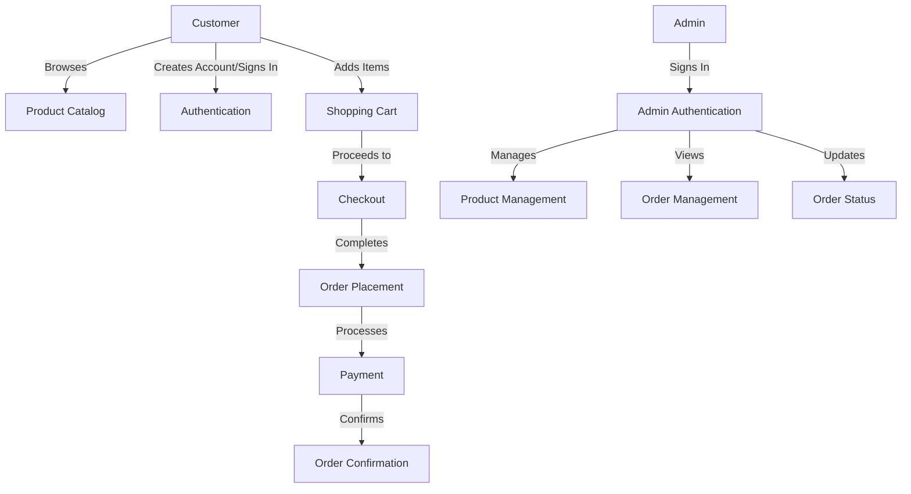

# Forever E-commerce

A complete e-commerce solution with customer-facing storefront, admin dashboard, and backend API.

## Project Overview

Forever E-commerce is a full-stack e-commerce platform built with modern web technologies. The project consists of three main components:

1. **Frontend**: Customer-facing storefront for browsing products, making purchases, and managing orders
2. **Admin Panel**: Dashboard for administrators to manage products, view orders, and handle inventory
3. **Backend**: RESTful API that serves both the frontend and admin applications

## Technology Stack

### Backend

- Node.js with Express.js
- MongoDB (with Mongoose ODM)
- JWT for authentication
- Cloudinary for image storage
- Stripe for payment processing

### Frontend & Admin

- React.js
- React Router for navigation
- Tailwind CSS for styling
- Axios for API requests
- React Toastify for notifications
- Vite as build tool

## Project Structure

```
├── admin/                 # Admin dashboard application
├── backend/               # API server
│   ├── config/            # Database and service configurations
│   ├── controllers/       # Request handlers
│   ├── middleware/        # Custom middleware
│   ├── models/            # Database models
│   └── routes/            # API routes
├── frontend/              # Customer-facing storefront

```

## Database Schema



## Application Flow



## Features

### Frontend (Customer)

- User registration and authentication
- Product browsing and searching
- Shopping cart functionality
- Checkout process
- Order history and tracking
- Responsive design for mobile and desktop

### Admin Panel

- Secure admin authentication
- Product management (add, edit, delete)
- Order management and status updates
- Simple and intuitive interface

### Backend API

- RESTful endpoints for products, users, carts, and orders
- JWT-based authentication
- Image upload to Cloudinary
- Stripe payment integration

## Acknowledgements

- [React](https://reactjs.org/)
- [Express](https://expressjs.com/)
- [MongoDB](https://www.mongodb.com/)
- [Tailwind CSS](https://tailwindcss.com/)
- [Vite](https://vitejs.dev/)
- [Cloudinary](https://cloudinary.com/)
- [Stripe](https://stripe.com/)
